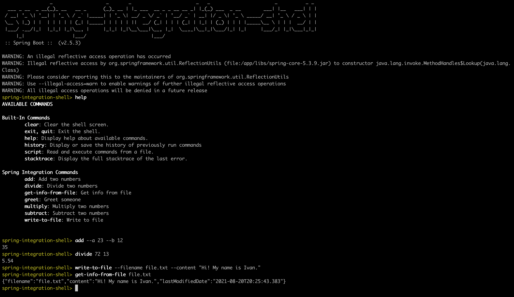

# spring-integration-examples

The goal of this project is to learn [`String Integration Framework`](https://docs.spring.io/spring-integration/reference/html/index.html). For it, we will implement some [`Spring Boot`](https://docs.spring.io/spring-boot/docs/current/reference/htmlsingle/) applications and try to use the well-known [`Enterprise Integration Patterns`](https://www.enterpriseintegrationpatterns.com/patterns/messaging/toc.html). 

## Project Architecture


## Applications

- ### calculator-api

  `Spring Boot` Java Web application that exposes an endpoint so that users can submit which operation (addition, subtraction, division or multiplication) they want to perform over two decimal numbers `a` and `b`.
  
  ```
  POST /api/calculate -d { "a": number, "b": number, "operation": ["ADD" | "SUBTRACT" | "DIVIDE" | "MULTIPLY"] }
  ```
  
- ### file-service

  `Spring Boot` Java Web application that exposes an endpoint so that users can get information about a file. This service keeps looking at `shared-integration-files` folder for new created or modified files and save their content and info in [`MongoDB`](https://www.mongodb.com/).
  
  ```
  GET api/files/{filename}
  ```

- ### spring-integration-shell

  `Spring Boot Shell` Java application that has a couple of commands. One is to write some content to a file. Those files are stored in `shared-integration-files` folder. Besides, there are some commands that uses `calculator-api` to compute the basic Math operations. There is also has a command that calls `file-service` in order to get information about a file. All the communication with `calculator-api` and `file-service` is over `HTTP`. Finally, there is a simple command called `greet`, so that you can display a greeting message on the screen depending on the time of the day.

## Prerequisites

- [`Java 11+`](https://www.oracle.com/java/technologies/javase-jdk11-downloads.html)
- [`Docker`](https://www.docker.com/)
- [`Docker-Compose`](https://docs.docker.com/compose/install/)

## Start Environment

- Open a terminal and make sure you are inside `spring-integration-examples` root folder

- Run the following command
  ```
  docker-compose up -d
  ```

## Running Applications

- **calculator-api**

  In a terminal and inside `spring-integration-examples` run
  ```
  ./mvnw clean spring-boot:run --projects calculator-api -Dspring-boot.run.jvmArguments="-Dserver.port=9080"
  ```

  Sample of calls to `calculator-api`
  ```
  curl -i -X POST http://localhost:9080/api/calculate \
    -H 'Content-Type: application/json' \
    -d '{"operation": "ADD", "a": 10, "b": 12}'
  ```

- **file-service**

  Open a new terminal and inside `spring-integration-examples` run
  ```
  ./mvnw clean spring-boot:run --projects file-service -Dspring-boot.run.jvmArguments="-Dserver.port=9081"
  ```

  Sample of calls to `file-service`
  ```
  curl -i http://localhost:9081/api/files/file.txt
  ```

- **spring-integration-shell**

  Open a new terminal and inside `spring-integration-examples` run
  ```
  ./mvnw clean spring-boot:run --projects spring-integration-shell
  ```
    
  Sample of the shell interface and execution

  
  
## Useful Commands

- **MongoDB**

  Find all files
  ```
  docker exec -it mongodb mongo
  use filesdb
  db.myFiles.find()
  ```
  > Type `exit` to get out of `MongoDB shell`

## Shutdown

- Go to `spring-integration-shell` terminal and type `exit`
- Go to `calculator-api` and `file-service` terminals and press `Ctrl+C`
- To stop and remove `MongoDB` and docker-compose network, run
  ```
  docker-compose down -v
  ```

## References

- https://docs.spring.io/spring-integration/reference/html/index.html
- https://github.com/spring-projects/spring-integration/blob/master/src/reference/asciidoc/file.adoc